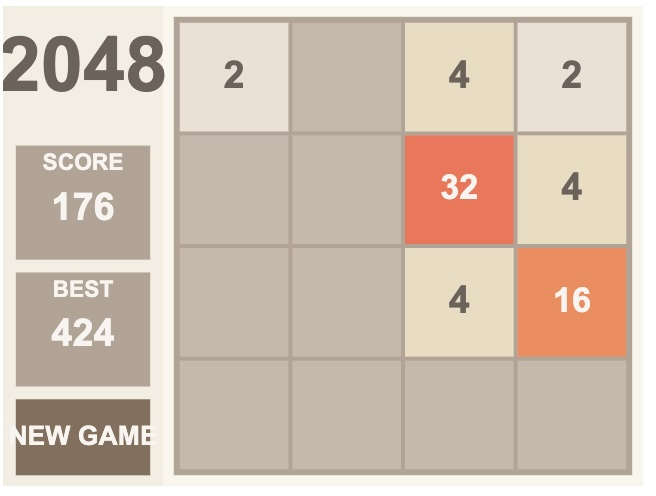

# Game Jam 2048

Attended Retro Game Jam @ HeatSync Labs, where @monteslu and @tooshel demoed their new JS game library, [JSGameLauncher](https://github.com/monteslu/jsgamelauncher).

We were encouraged to use AI to generate the base of a game, and then modify it from there to make it our own. For my game, it just ended up being a straight clone of 2048 because I kept running into bugs related to new tiles being drawn and how they were animated.

I demoed my game at the end of the jam, and it was well received. I was able to get the game to a playable state, but there are still some bugs that need to be worked out (such as the fail state screen!).

## How to Play

Clone the repo and run `npm install` to install the dependencies. Then run `npm run dev` to start the game. It'll be at `localhost:5173`.

Use the arrow keys to move the tiles. When two tiles with the same number touch, they merge into one!
